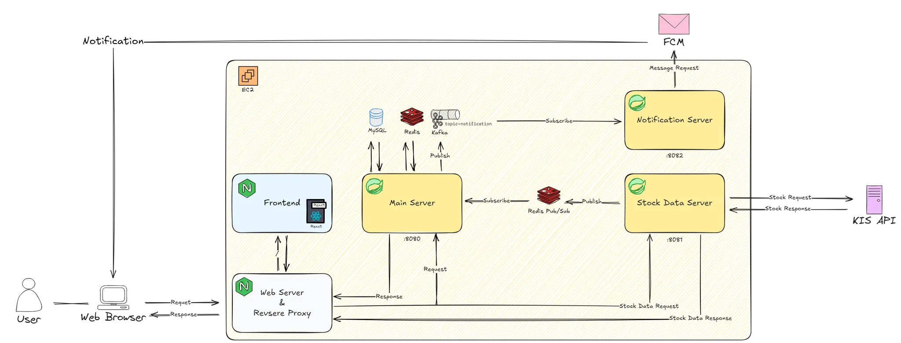
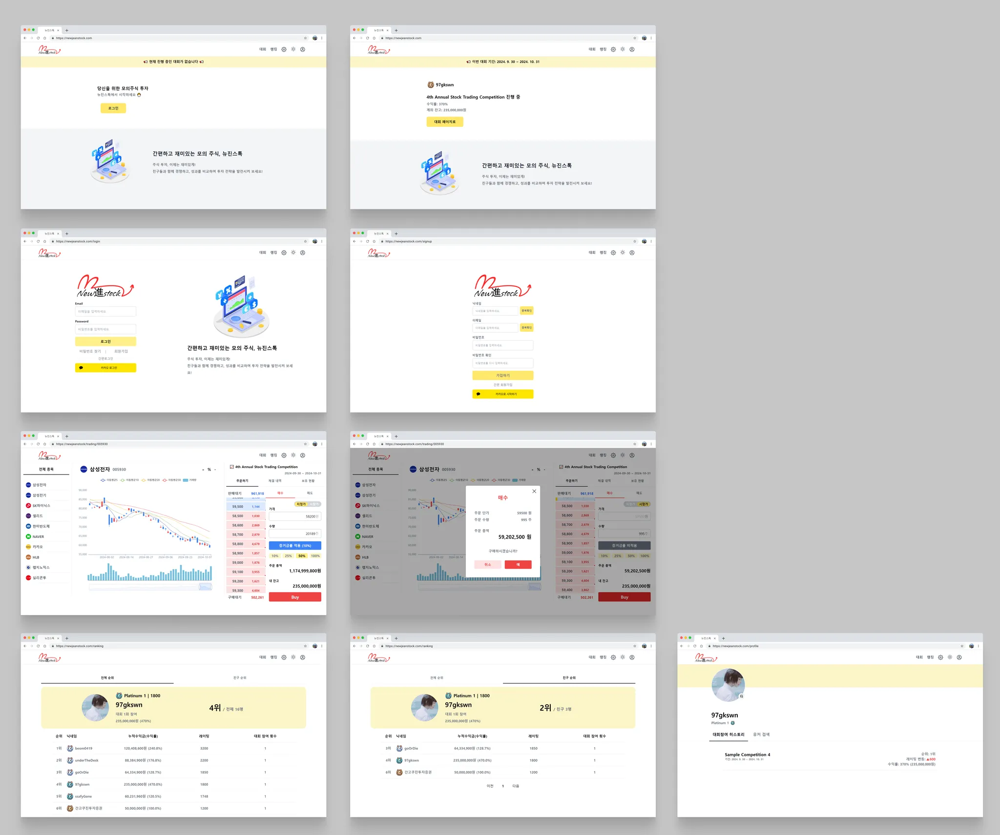

# 새롭게 나아가는 주식, 뉴진스톡

## 📖 **프로젝트 개요**

**“뉴진스톡”** 서비스는 계속해서 높아지는 주식 투자에 대한 청년층의 관심에 대해 청년의 건전한 금융생활을 지원하기 위한 서비스입니다. 

 가능한 한 실전에 가까운 서비스 구성을 통해 주식을 처음 접하는 사람들에게 손쉬운 연습 환경을 제공하고 랭킹 시스템을 통해 사용자의 주식 투자 실력을 판단할 수 있는 지표를 제공함으로써 무분별한 투자를 예방하는 것을 목표로 하고 있습니다.
 

## 🔎 **주요 기능**

1️⃣ **인증 및 인가**

- 회원가입, 로그인
- OAuth2.0을 이용한 소셜 로그인
- JWT 토큰 기반 사용자 인가 

2️⃣ **주식 거래**

- 시장가 매수 및 매도, 지정가 매수 및 매도
- 미수 거래 기능 (증거금률)
- 매수 및 매도 요청 취소 기능
- 보유주식 및 잔고 조회 기능
- 거래 체결 알림 기능

3️⃣ **랭킹** 

- 주식 대회가 끝나면 해당 대회의 수익률을 기반으로 rating에 반영
- 체스의 ELO rating system을 차용한 레이팅 시스템
    - 대회 참여한 모든 1:1 쌍에 대해 ELO rating 계산식으로 승률을 계산 -> 예상 등수를 구할 수 있음
    - 현재 대회에서 예상 등수를 얻기 위한 performance rating을 계산
    - 자신의 rating과 performance rating 차이를 적절하게 rating에 반영

4️⃣ **마이페이지**

- 닉네임, 비밀번호 변경 기능
- 사용자 프로필 이미지 등록 및 업데이트 기능
- 사용자 라이벌 등록

## ⚒️ **기술 스택**

**Frontend**: JavaScript, React, Zustand

**Backend**: Java, Spring Boot, Spring Security, JPA

**Database**: MySQL, Redis

**Notification**: FCM

**Infrastructure**: AWS EC2, NginX, Docker, Jenkins, Kafka

**Communication**: Notion, Mattermost, Figma

📰 **구현 사항**

---

**Architecture**

**UX/UI**

